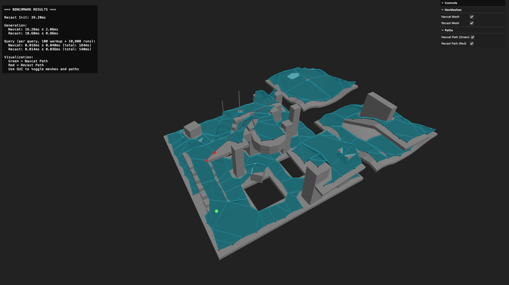

# navcat vs recast-navigation-js benchmark

```bash
npm install
npm run dev
```

```
Recast Init: 40.50ms

Generation:
  Navcat: 16.02ms ± 1.24ms
  Recast: 6.36ms ± 0.80ms

Query (per query, 100 warmup + 10,000 runs):
  Navcat: 0.018ms ± 0.039ms (total: 179ms)
  Recast: 0.008ms ± 0.028ms (total: 81ms)
```


